# Communicate your findings {#sec-results}

```{r}
#| label: setup
#| include: false

# set options
knitr::opts_chunk$set(
  tidy = FALSE, 
  message = FALSE,
	warning = FALSE)

options(htmltools.dir.version = FALSE)

```

After completing this set of activities, you should be able to:

-   List the four key sections of a research paper and what their central purpose is.
-   Outline the structure of a lab report and describe key components for each section of a lab report.
-   Use Microsoft Word to format a lab report with headers and sub-headers.
-   Use Microsoft Word to insert figures and tables along with captions and reference them in your document.
-   Summarize, paraphrase, and attribute information from sources and cite them using the author-year format.

## Work out your lab report components

It can be helpful to build your lab report in a non-linear fashion. Our lab manual contains a chapter on writing a lab report with general pointers and specific information about what to include in each component that you should use as a reference (@sec-writing-a-scientific-report); much of that information is included here but you will find more details in that chapter.

A key piece of advise is to write through your experiment as to writing it up. This means that keeping good notes that you can then easily convert into your methods, results, introduction, and discussion section will make your writing process a lot smoother. Writing up specific section as you go will also help you think through the various steps of your experiment.

### Methods

**Your method section should describe your study design, how you collected, processed, and analyzed the data.**

Start with your methods section to describe how you conducted your study, which treatments you included (explanatory variables) and specifically how you gathered and analyzed your data (response variables). Remember that it should be sufficiently detailed so your study could be repeated by somebody else and reproduce the same results - but should also be written as a paragraph not as a step-by-step lab protocol.

#### Summary/Transition

You developed a hypothesis using the IF-THEN-BECAUSE format a few weeks ago.

-   IF: connect with an expected/observed pattern that interests your group
-   THEN: suggest a relationship that might explain or follow this pattern)
-   BECAUSE: explain your reasoning.

The last part is the hypotheses that you are planning to test with the data set you will be gathering. For example, I have chosen these two hypothesis, the first focuses on changes in the milk itself (abiotic conditions) and the second focuses on the microbial community (biotic conditions).

> **IF** spoiled oat milk contains less protein (casein) compared to dairy milk, **THEN** it will not curdle but instead become slimy, **BECAUSE** curdling in dairy milk occurs when microbial fermentation lowers the pH, causing casein proteins to coagulate and form curds. Oat milk, which lacks significant amounts of casein, does not undergo the same protein coagulation process. Instead, spoilage-associated microbes may produce exopolysaccharides or other metabolites that lead to a slimy texture rather than curd formation.
>
> **IF** oat milk does not experience the same drop in pH as dairy milk during spoilage, **THEN** it will have less fungal growth over time, **BECAUSE** in dairy milk, bacteria such as *Streptococcus* and *Lactobacillus* ferment lactose into lactic acid, lowering the pH and creating conditions that favor fungal growth. Oat milk, which lacks lactose and has different carbohydrate sources, undergoes less acidification, resulting in a higher pH environment that may be less conducive to fungal colonization and growth.

For the first hypothesis my explanatory (independent variable) is milk type/presence/absence of casein and my response variable is milk consistency (curdling/slimness). For the second my explanatory variable is the change in pH over time and the response variable is the observed fungal growth. In both cases whole milk will serve as my positive control. The process of whole milk acidifying and cudling is well understood and a known outcome. The refrigerated samples of whole and oat milk serve as negative controls that are expect to remain unchanged in terms of their physical characteristics and microbial community.

::: {.callout-tip title="Give it a try"}
Go back to your notes/assignments and add your two hypothesis below. Then identify your explanatory and response variable as well as your positive and negative controls.
:::

.

::: {.callout-caution title="Your Answer Here"}
**Hypothesis 1:**

\[Add if-then-because statement here\]

-   explanatory variable
-   response variable
-   positive control
-   negative control

**Hypothesis 2:**

\[Add if-then-because statement here\]

-   explanatory variable
-   response variable
-   positive control
-   negative control
:::

Next, summarizing your study design and objectives. You should always be able to make a 2-3 sentence statement summarizing what you are investigating and how you did it, it’s a good self-check that you know what you’re trying to accomplish.

This statement will serve as your transition from the introduction to the methods. You can use a "formula" below to make sure that your introduction ends with a clear statement of the purpose of your study that summarizes your introduction.

> In this study, we investigated \[CENTRAL QUESTION OR HYPOTHESIS\]. To do this we used \[DESCRIPTION OF HOW DATA WAS GENERATED\] to \[OBJECTIVES: METRICS THAT WERE CALCULATED/WHY\].

Here is an example for the example above:

> In this study, we investigated how differences in protein composition and pH changes during spoilage influence the physical and microbial characteristics of oat milk compared to dairy milk. To do this, we monitored changes in pH, texture, and microbial growth over time by measuring acidity, assessing curdling or sliminess, and observing fungal presence. These data allowed us to evaluate how the absence of casein and differences in fermentation dynamics impact oat milk spoilage.

::: {.callout-tip title="Give it a try"}
Go back to your notes/assignments and review your initial draft of your summary statement. Compare it to the example above and make any revisions you want as you add it below.
:::

.

::: {.callout-caution title="Your Answer Here"}
\[Add summary/transition statement here\]
:::

#### Experimental Design & Data Analysis

The next step is write your methods section that elaborates on your summary[^b06_report-1]. It can be helpful to structure your method section with subheadings to include important components of your study.

[^b06_report-1]: Well, at this point we'll make our first notes that we can then use as an outline to write our report.

**Study area/Site description or Laboratory Setting/Experimental Conditions**

-   Describe geographic location, habitat of field experiment, you may want to include a map as a figure.
-   For controlled experiments you would include information on where the study was conducted and under what conditions.

::: {.callout-tip title="Consider this"}
In the space below take a few notes to describe the Laboratory Setting/Experimental Conditions for this study.
:::

.

::: {.callout-caution title="Your Answer Here"}
\[Take some notes\]
:::

**Experimental design**

Concisely describe how you set up your experiment in terms of sample size, replicates, what measurements where taken to produce the data set that was then analyzed.

::: {.callout-tip title="Consider this"}
Review the @sec-generate-your-data and @sec-collect-your-data sections of your lab manual. Then in the space below take some notes on what information you will need to include to describe your experimental design. Include notes on what information you might need the details for.
:::

.

::: {.callout-caution title="Your Answer Here"}
\[Take some notes\]
:::

**Data Analysis**

include how you manipulated data to obtain results, specific calculations, descriptive statistics to summarize data (what metrics you produced), statistical tests.

::: {.callout-tip title="Consider this"}
How you processed your data and produced your results is a key component of your methods. Review the @sec-collect-your-data section of your lab manual and take some notes below in terms of which information you might need to include for this section.
:::

.

::: {.callout-caution title="Your Answer Here"}
\[Take some notes\]
:::

### Results

**This section should present your results based the visualizations and any processing of data (e.g. descriptive and inferential statistics) you applied to analyze your data set.**

Your results section should include a written description along with data visualizations in the form of tables and figures that present your results in a way that makes it easy for the reader to identify key findings. Focus on describing trends and patterns and report which findings are significant. Highlight notable results, when you mention anomalous and unexpected results make sure you pick up on those in the discussion. Remember that you should not be interpreting your data by comparing them to results from other studies, or interpreting them in the context of your research hypothesis.

#### Describe your results

Now it is time to describe your results. It will be helpful to your reader if you follow the same structure as your methods, i.e. if your methods first speak to observing physical characteristics of the milk, you will want to describe those results first. Your results should not be "reading aloud a table" (or figure) and just listing out values, rather the written description allows you to give context to your results ("increased", "wider", "smaller") and guide the reader through your results that you have spent a lot of time thinking about but are new to them. To achieve this, it can be helpful to use a formula of "broad observation - highlight notable details".

::: {.callout-tip title="Give it a try"}
Look over your results and identify the individual components (variables) you will need to include. Then, for each make a note on what the broad trend is as well as notable highlights; use bullet points that you can then easily write up.
:::

.

::: {.callout-caution title="Your Answer Here"}
\[Take some notes\]
:::

While your written description alone should provide all the needed information without the figures and tables, your figures and tables should complement the text of your report. You should present your results in only one format as either a table or figure that support your written descriptive narrative of your results. You do want to make sure that your figures and tables stand alone by giving them a descriptive figure caption comprising of a descriptive title along with any other information that is needed to understand the information being presented. Figures and Tables should be numbered, by convention captions are placed below figures and above tables. Any figure or table that you include should be referenced in your text.

::: {.callout-tip title="Give it a try"}
Go back over your results and decide which figures and/or tables you want to include and list them in the space below, be specific.
:::

.

::: {.callout-note title="Answer" collapse="true"}
:::

.

::: {.callout-caution title="Your Answer Here"}
\[Take some notes\]
:::

#### Summary/Transition to Discussion

Similar to our transition from introduction to methods, you should be able to summarize your key findings in a few sentences. This can be done even before you start writing out your results section, or after you have described your results and have had time to think through how they relate to your original hypothesis/question.

Again, you can follow a fill-in-the-blank-formula, which as you become more comfortable communicating your research will sound a little less formulaic and a little bit more you.

> In this study, I investigated \[broad question asked/hypothesis tested\]. To achieve this, I \[specific data set + analysis used\]. I found that \[key results\] which \[statement about how this does or does not support your hypothesis\].

::: {.callout-tip title="Give it a try"}
Review your results and draft a summary/transition paragraph below.
:::

.

::: {.callout-caution title="Your Answer Here"}
\[Draft your summary/transition here\]
:::

### Discussion

**A good discussion evaluates context, acknowledges constraints, and justifies conclusions.**

Our reports will have a very brief introduction with two paragraphs, one presenting the "big research question" and the second introducing your specific study. In that case, whether your write your discussion or your introduction first does not really matter. For more detailed reports first working out your discussion can be really helpful because it will inform what content needs to be included in the introduction because you would want to make sure that any information the reader will need to interpret your results has already been presented to them. Your discussion should mirror your introduction in structure and scope, as now you start with your specific study and build your discussion back out to the broad context you set up initially.

A good discussion will build on your summary/transition statement to write an effective discussion that reiterates the key results and interprets them, acknowledges constraints of the study design and other possible caveats limiting clear interpretation, states clear conclusions/take-home messages, and points to results (figures or tables) as evidence thereof.

In addition to ending with a clear set of conclusions you should include these four components:

-   Interpret your results and compare them to your expectations and other studies[^b06_report-2]:
    -   Did your results match your predictions?
    -   Do your results support your hypothesis? How do you interpret them in that context?
    -   Why do you think you ended up with these results?
    -   Are your results consistent with similar studies/your classmates results? Different? Why?
-   Discuss constraints/limitations, inconsistencies, other possible explanations[^b06_report-3]
    -   Acknowledge and discuss constraints, point out shortcomings and any caveats for how your data should be interpreted.
    -   Explain unexpected results.
    -   If results are inconsistent/ambiguous why are you confident you are interpreting them way you are?
    -   Are the other possible explanations? Other reasons of why you may have ended up with the results you did?
    -   Are there any errors, assumptions, ambiguities etc that could have impacted your results? Why you are still confident interpreting you data as you are?
    -   How might you redesign the experiment for more clear results?
-   Discuss implications of your results[^b06_report-4].
    -   How do your results contribute to answering your overarching research question?
    -   Why is your study important? What do we know now that we didn't before?
-   Future steps
    -   What questions where generated?
    -   What is the next step to even better understand your overarching research question?

[^b06_report-2]: In this semester we will generally keep the "compare to other studies very small, don't worry, you won't have to go on an extended literature search.

[^b06_report-3]: This is still really specific to your study.

[^b06_report-4]: Now you are broadening your scope to the broader context in which you asked your question

Remember to wrap up your discussion with a firm conclusion that summarizes the key findings and the interpretation of your study.

::: {.callout-tip title="Give it a try"}
These four sections build from very specific interpretation of your results to then placing them in a larger context. However, this is not an outline where you just need to check off each question with a sentence. Rather these are questions for you to consider in the context of your experiment to help your figure out what the important discussion points will be. Not all of them will apply.

In the space below take some notes on what your key discussion points will be.
:::

::: {.callout-caution title="Your Answer Here"}
\[Take some notes\]
:::

### Introduction {#sec-introduction}

**Your introduction should establish the context the reader needs to understand the topic.**

Think of your introduction as the funnel or top piece of an hourglass that starts off broad and become increasingly focused on the specific focus of your study.

-   Introduce the broad topic/general research question you are asking, including why this is an important question to be asking. Give a brief overview of the current state of understanding of the research question. Make sure you introduce any key terms/concepts to set up the context of a large question/scientific field or overarching theme.
-   Increasingly narrow your scope down to the specific focus of your study. Describe why your question is relevant and how it furthers the understanding of this question: Even though you cannot fully answer the big question you laid out, you can contribute to part of the answer by filling a knowledge gap or clarifying existing conflicting results.
-   Clearly state the purpose of your research, you should state what your hypothesis is, what you expect to find and why, and how you are testing this[^b06_report-5].

[^b06_report-5]: No details about your methods/results yet at this point, just brief "how".

You should always have at least two paragraphs. The first, sets up the broad context[^b06_report-6].

[^b06_report-6]: For a lab report you can likely do this in a single paragraph, in a longer research paper you will likely then take several following paragraphs to flesh out relevant background information

::: {.callout-tip title="Give it a try"}
We have previously identified our "big question" to be either "Ecological Succession: how abiotic conditions shape biological communities and how biological communities shape abiotic conditions of ecosystems" or the broad topic of food spoilage or food safety.

Finalize your opening paragraph choice and in the space below take a few notes on what information needs to be in your opening paragraph. Remember start broad - land on milk to transition to your next paragraph.
:::

.

::: {.callout-caution title="Your Answer Here"}
\[Take some notes\]
:::

The last paragraph summarizes what the specific study at hand is investigating and how that will be done. It forms a “bridge” between the introduction that sets up relevant background information (why is my question important?) and the methods section which is a very detailed account of how data was acquired (experimental design), processed, and analyzed.

::: {.callout-tip title="Give it a try"}
Go back over your notes/assignments. You have previously noted key differences among the milk types, this will come in handy as you think about what information you want to include in your second introduction paragraph. Take a few notes below.
:::

.

::: {.callout-caution title="Your Answer Here"}
\[Take some notes\]
:::

### Title {#sec-title}

Yes - you still need a title! Now that you know what your findings are and how you are interpreting them, coming up with a title will be a breeze.

Your title should be informative and clearly state the main focus or purpose of your study. It does not need to be especially clever or thought-provoking, your focus should be on clear communication. There are typically two ways to do this, either by a stating what was done or what was found. You should also consider how broad to make your title.

::: {.callout-tip title="Give it a try"}
Draft a workingg title for your report below.
:::

.

::: {.callout-caution title="Your Answer Here"}
\[Take some notes\]
:::

## Format your report

### Use headers to structure your report

Define styles using the styles menu

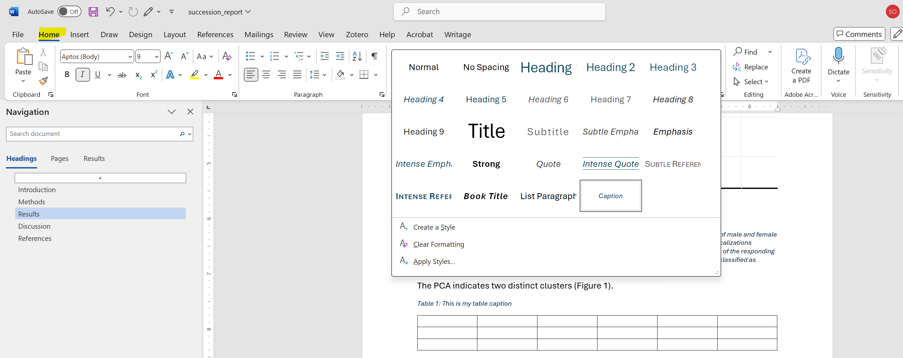

You can modify any style which will then be applied to any part of your document that has been classified into one of those styles.

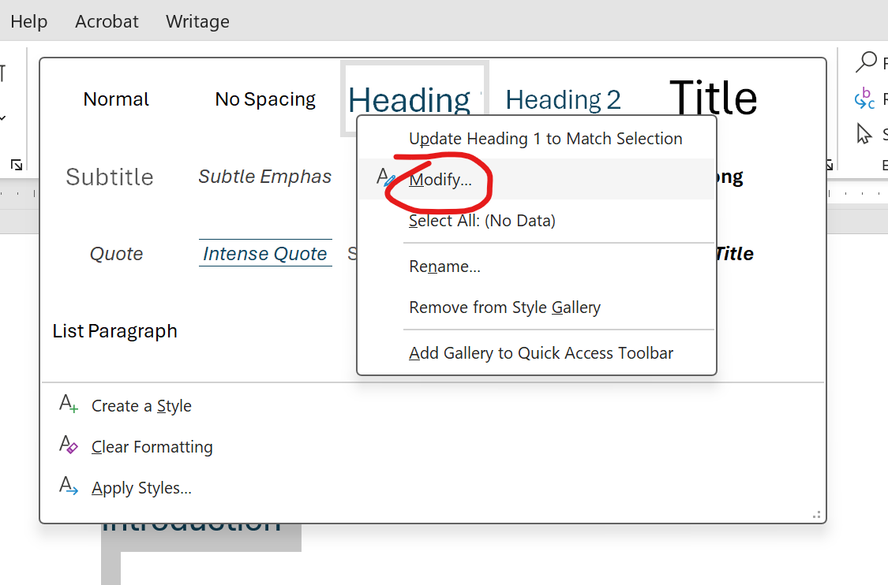

Format text as title and hierarchical headers.

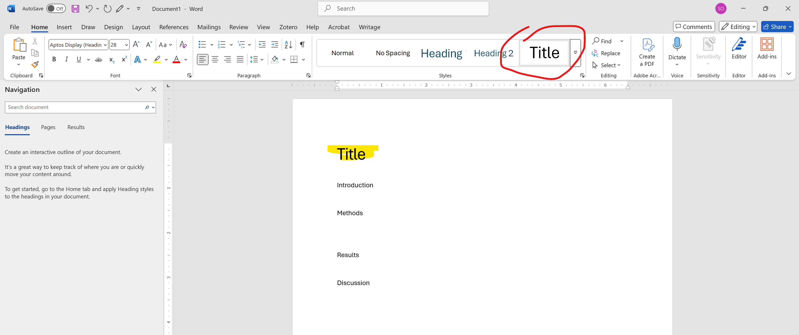

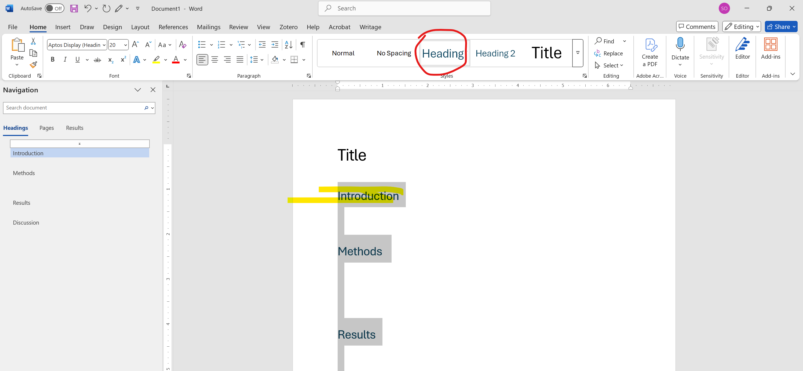

Open the navigation pane.

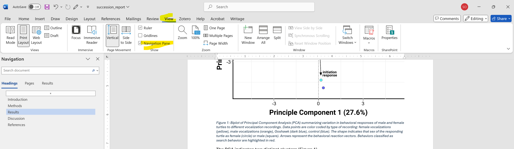

Insert table of content.

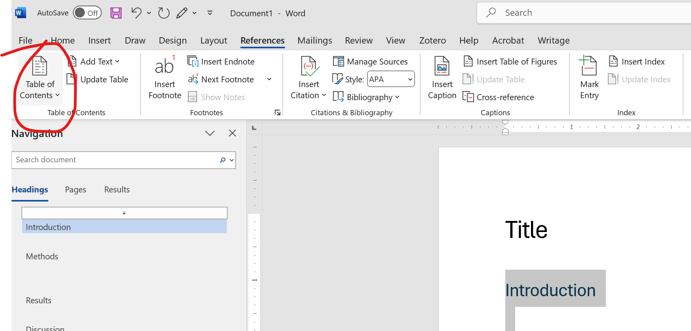
Update table of contents

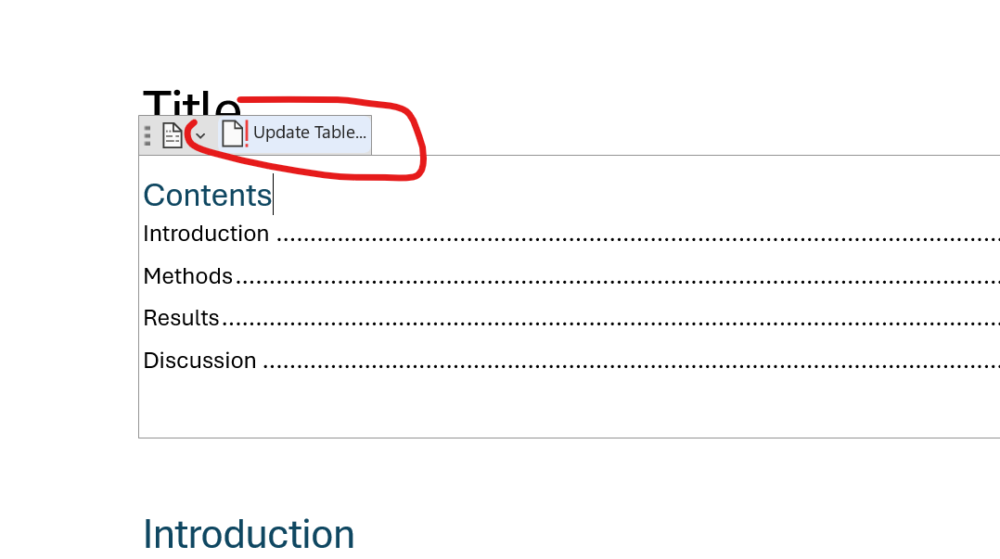

### Figures/tables and captions

Insert figures and table

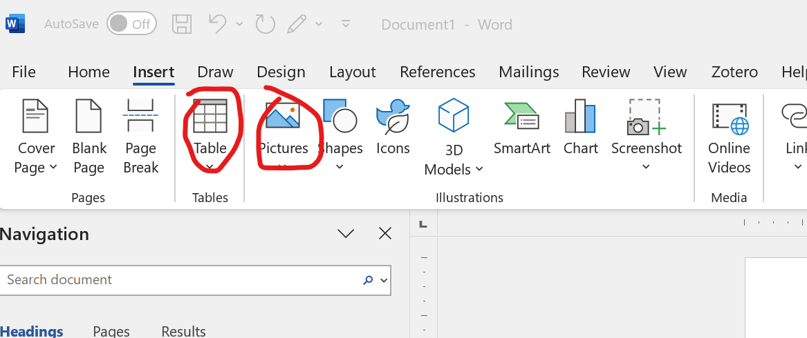

Insert captions for figures and tables

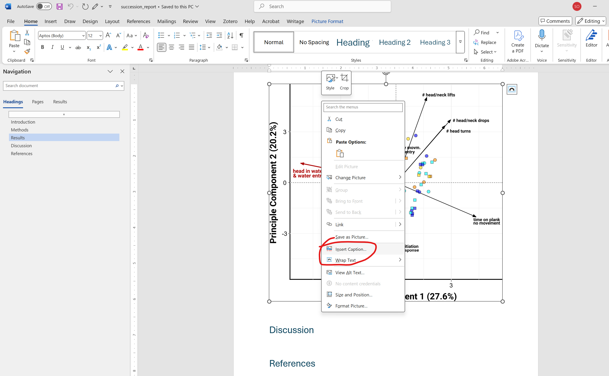

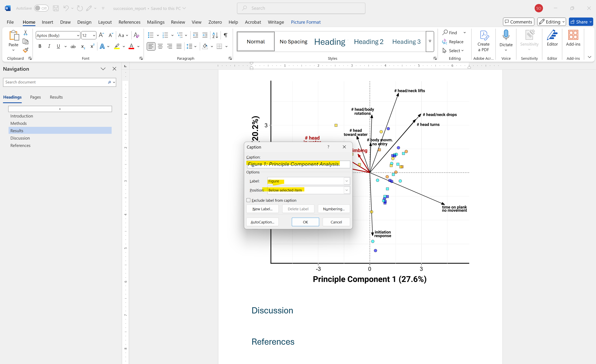

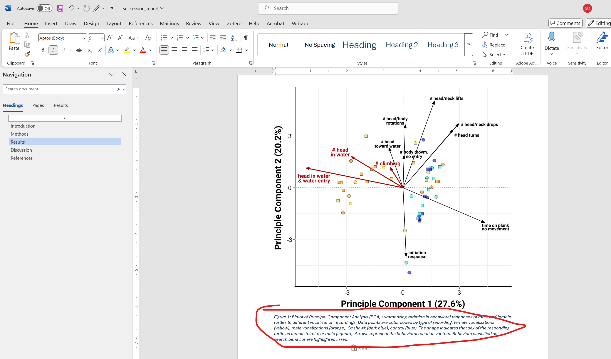

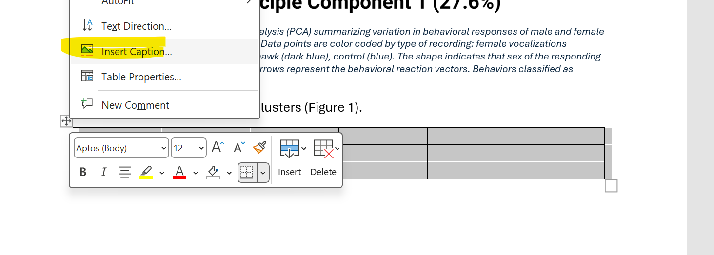

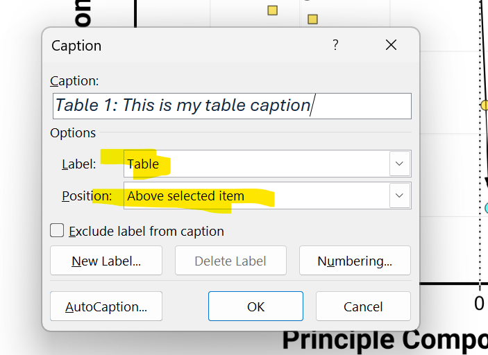

Use cross-references.

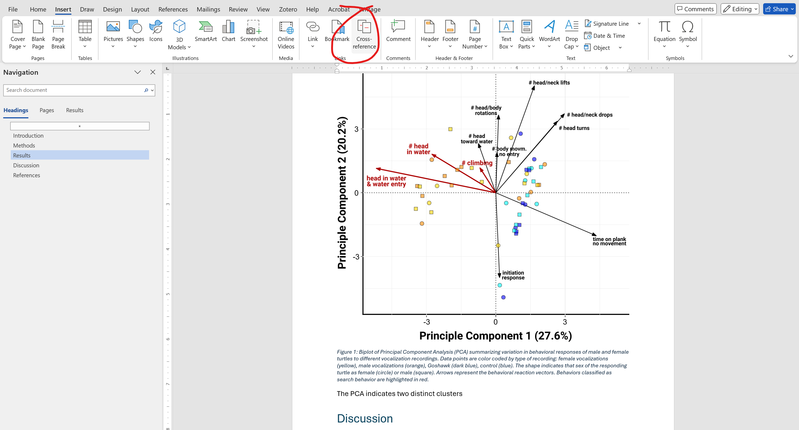

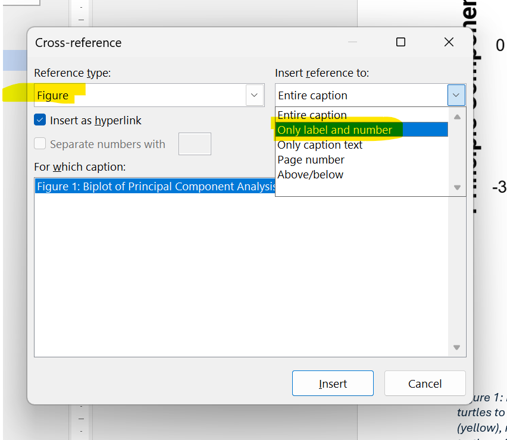

### Additional formatting

Double space.

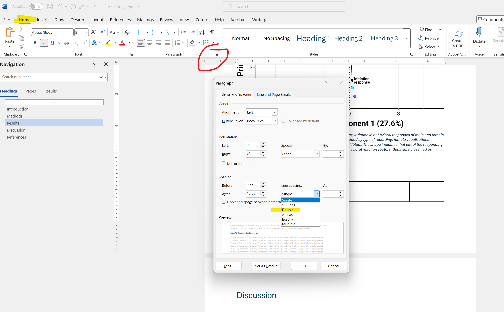

Insert page numbers.

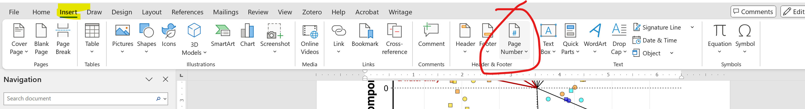

Force a page break.

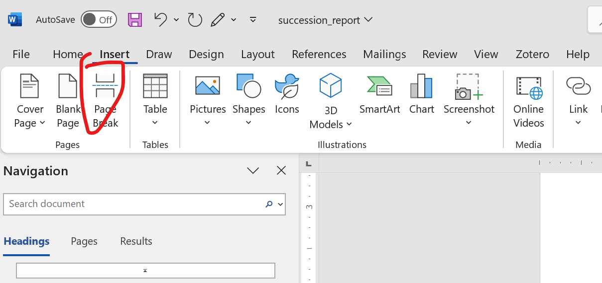

## Adding context to your introduction and discussion

For this lab report we are sticking very close to our study with very brief introduction and discussion sections. [**There is no expectation that you do any additional research for information to cite in your introduction or discussion**]{.underline}.

### What do we cite?

For the most part our introduction and discussion contain the two types of information that we do not need to cite, **general common knowledge** and **field-specific common knowledge**. General common knowledge are facts that are considered to be in the public domain. For example, you would not need to cite that bacteria and yeasts are considered microbes or that milk spoils when left out or that lactose is a disaccharide consisting of of glucose and galactose. That second example starts to fall more into the realm of field-specific knowledge. With field-specific knowledge it becomes a bit more tricky, these are facts that we consider to be common within a specific field of study, e.g. ecological succession is a well-documented effect. However, it can get a bit blurry of where those boundaries are and so when in doubt, attribute the original source.

Typically, we document **another authors specific words and phrases** and **information and ideas** with citations pointing towards the original author (primary literature or grey literature[^b06_report-7]) or works that have analyzed, synthesized, and interpreted primary research (secondary literature[^b06_report-8]). Papers in the humanities and literary analysis frequently use direct quotations because that is essentially your data and you need to present it to support your analysis of specific words and phrases. In the social and natural sciences we **summarize, paraphrase** [^b06_report-9] and then **attribute** the specific pieces of information (frequently data/results, or examples/case studies) and individual ideas/arguments, methods, theories, processes etc. to the original author.

[^b06_report-7]: Primary literature refers to original research findings published in a peer-reviewed journal, grey literature is information not published through traditional journals that have undergone some sort of review/fact checking like government reports or internal company documents.

[^b06_report-8]: Secondary literature typically appears as review articles or textbooks and summarizes primary literature for a specific topic. Review articles can sometimes fall into both primary and secondary literature. A review article that synthesizes other work to produce something new or formalize a certain argument/theory for the first time is frequently considered primary literature.

[^b06_report-9]: There should be no direct quotations in your lab report!

Two big ideas in for our lab report are ecological succession and the spoilage of milk. You can use your textbook when you are talking about ecological succession in general and your lab manual when you are specifically referencing the well-understood process of ecological succession during milk spoilage.

-   Urry, L. A., Cain, M. L. 1., Wasserman, S. A., Minorsky, P. V., Reece, J. B., & Campbell, N. A. (2017). *Campbell biology*. Eleventh edition. New York, NY, Pearson Education, Inc.
-   O'Leary, S. J. *Lab Manual General Biology II* (2025) \[unpublished manuscript\], Department of Biological Sciences, Saint Anselm College.

::: {.callout-tip title="Consider this"}
Are these primary sources or secondary sources?
:::

::: {.callout-note title="Answer" collapse="true"}
Textbooks and lab manuals are typically secondary sources because they summarize and explain existing knowledge rather than generating new data. The typically compile and synthesize existing knowledge from primary sources rather than presenting new findings and provide interpretations, explanations, and context for scientific concepts.
:::

::: {.callout-caution title="Your Answer Here"}
\[Take some notes\]
:::

Both the rubric and your description for how to write an effective discussion does include the following expectation/prompt "Are your results consistent with similar studies/your classmates results? Different? Why?"

For the most part, you built your hypothesis using information provided in your lab manual which is based on primary research that has documented ecological succession in milk (category of "similar experiments"). You had a list of which microbes typically appear at what stages and what the changes in the physical characteristics (smell, consistency should look like. In your discussion when you determine whether or not your results match your expectations you will want to reference that information to show that it looks like "normal spoilage" or that it is an unexpected result.

Most of you are not comparing all four milk types, but in your discussion you might want to reference that you saw a similar trend support your conclusions in another one of the treatments. One option would be to cite the lab report of a class mate. For a simpler solution, we can cite them as a **personal communication**. You could also use this format of you e.g. talked through your results with a peer or your instructor and they gave you unpublished information[^b06_report-10]. Because is a format that is only used if a recoverable source is not available, you will also find that some journals do not not allow them at all - they are problematic because while you are correctly attributing the original author (good thing) these results are not recoverable so nobody can verify (bad thing). Personal communications are not included in the reference list, only in-text.

[^b06_report-10]: For example, in my work we often speak to fisheries managers and they will give us information like "well the fish always come back in the first two weeks of February" but that is not published information. That is different from talking to a colleague who says "oh, we ran a similar experiment and found x" and that is published then you would track down their paper.

The format would look like this:

-   "Oat milk tastes sour when left on the counter too long (J. Doe, personal communication, Jan 2020)" as a parenthetical citations
-   Doe reported that oat milk tastes sour when left out on the counter too long (personal communication, Jan 2020).

Most of you built your hypothesis around specific characteristics like sugar content/type, fat content, initial pH, or protein. Here are a few pieces of information from papers that might provide context for your interpretation in addition to information from the lab manual.

-   Srinivas, D., Mital, B. K., & Garg, S. K. (1990). *Utilization of sugars by Lactobacillus acidophilus strains*. International Journal of Food Microbiology, *10*(1), 51-57.

    -   The specific strain of *Lactobacillus acidophilus* is able to use lactose in milk because it has the enzyme to break the disaccharide into glucose and galactose and then ferment it to produce lactic acid.
    -   This study tested the utilization pattern of glucose, galactose, fructose (monosaccharides) and sucrose, lactose (disaccharides) which use different pathways that may intersect to a certain extent.
    -   Key results in the abstract: "Maximum viable counts, acid production and sugar utilization by different test strains where in this order: glucose \> fructose \> sucrose \> lactose \> galactose. The generation time of the tested strains was shorter in glucose medium as compared to sucrose or lactose medium.

-   Iyer, R., Tomar, S. K., Maheswari, T. U., & Singh, R. (2010). *Streptococcus thermophilus strains: Multifunctional lactic acid bacteria.* International Dairy Journal, *20*(3), 133-141.

    -   Review article
    -   *Streptococcus thermophilus* is frequently used to manufacture fermented dairy foods (cheese!)
    -   *S. thermophilus* prefers lactose over other sugars

-   Jayashree, S., Pushpanathan, M., Rajendhran, J., & Gunasekaran, P. (2013). *Microbial diversity and phylogeny analysis of buttermilk, a fermented milk product, employing 16S rRNA-based pyrosequencing*. Food Biotechnology, *27*(3), 213-221.

    -   16S sequencing to determine microbial community of buttermilk (fermented dairy product)
    -   results from abstract "A total of 23,080 high-quality pyrosequencing reads was obtained. Of these, 96.3% of reads represented the well-defined domain bacteria and 3.7% represented unclassified domain; no archaeal sequences were found. *Lactobacillus delbrueckii* was the most predominant species identified, which constituted 94.86% of total reads"

-   Buzby, J. C., Farah-Wells, H., & Hyman, J. (2014). The estimated amount, value, and calories of postharvest food losses at the retail and consumer levels in the United States. *USDA-ERS Economic Information Bulletin*, (121).

    -   at 17% dairy foods 3rd highest dollar amount (\$165.6 billion) of food wasted (consumer, retail level)

-   Martin, N. H., Torres-Frenzel, P., & Wiedmann, M. (2021). Invited review: Controlling dairy product spoilage to reduce food loss and waste. *Journal of Dairy Science*, *104*(2), 1251-1261.

    -   "Mechanisms of dairy product spoilage: (1) the production of extracellular enzymes that break down components including proteins, lipids, and lactose, producing off-odors, off-flavor, and body defects (e.g., coagulation in fluid milk); (2) visually detectable growth, most often by spoilage fungi; (3) production of pigments by bacterial and fungal contaminants; and (4) other metabolic processes (e.g., fermentation)."

Some of you have formed hypothesis about the starting pH conditions. A key principle to keep in mind here would be the competitive exclusion principle to consider what organisms might outcompete each other given different environmental conditions.

-   Gause, GF. (1932). Experimental studies on the struggle for existence. *Journal of Experimental Biology* 9: 389-402.

### How do we cite?

Your lab report should be formatted according to the APA (American Psychological Association), which is the citation format typically used in the natural and social sciences, including biology and the environmental sciences. For documents in APA style we include and alphabetical reference section at the end of a document, listing all sources cited in the text. Each entry in the reference list follows a specific format based on the type of source (e.g., journal article, book, website). Within the text, citations are formatted using the **author-year system**, which helps readers easily locate the full reference in the bibliography.

In-text citations in APA style can be either narrative or parenthetical. A **narrative citation** incorporates the author’s name into the sentence, followed by the publication year in parentheses, such as **Smith (2020) found that environmental factors influence species distribution.** This format is often used when emphasizing the researcher’s contributions. In contrast, a **parenthetical citation** places both the author's last name and the year within parentheses at the end of a sentence, such as **(Smith, 2020).** Parenthetical citations are commonly used when the focus is on the information rather than the author. If a source has two authors, both names are listed with an ampersand (**Smith & Jones, 2020**), while for three or more authors, only the first author's name is included, followed by "et al." (**Smith et al., 2020**).

## Additional Resources for writing

Really, the only way to become a good writer is to do a lot of it. Additionally, comparing your work that of others to identify patterns in a certain writing style. Similarly, allowing other people to critique your work will help you identify your weaknesses. While even for scientific writing you want to write in your own voice there are certain rules and conventions. It can be helpful to first learn the rules and conventions and then you can start breaking them to achieve a specific effect and to start developing your own style.

Here are some additional resources as you continue on your writing journey:

-   [The Academic Phrasebank](https://www.phrasebank.manchester.ac.uk/): This was designed as a general resource for non-native speakers. It has a menu of "general language functions" (e.g. "being critical" or "describing trends") and then examples for more specific goals (e.g. "Introducing problems and limitations" or "highlighting a trend in a table or chart").
-   The University of Wisonsin-Madison's Writing Center's [guidelines for quoting and paraphrasing](https://writing.wisc.edu/handbook/quotingsources/).
-   [Purdue Online Writing Lab](https://owl.purdue.edu/owl/index.html).
