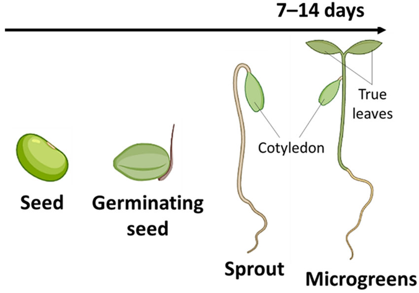
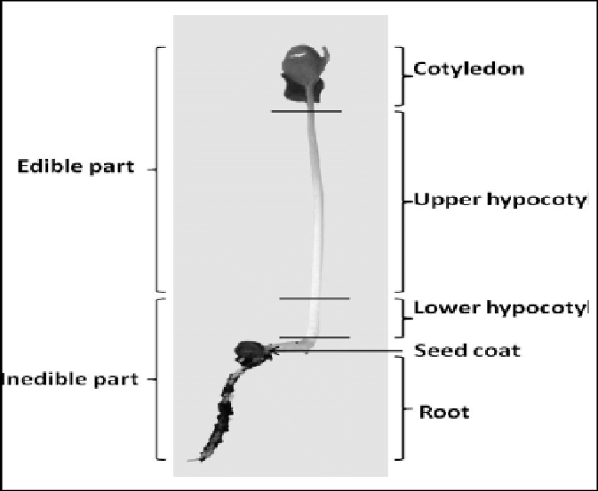

# Collect your data {#sec-collect-your-data-bioassay}

After completing this set of activities, you should be able to:

-   Visually inspect a radish seed and identify whether it has germinated by observing the radicle poking through a swollen seed.
-   Distinguish between the radicle and hypocotyl of a germinated radish seedling.

## Determine the germination rate

{#fig-germination-process width="600"}

### Step 1:

Take a look at @fig-germination-process to get an overview of how radish seeds germinate. [You can also check out a 20 second video of a radish seed germinating using this link](https://www.youtube.com/results?search_query=radish+seed+germinates+on+top+of+ground).

-   Radicle Emergence – The first sign of germination is the appearance of the radicle, or primary root, which emerges from the seed coat and anchors the seed in place.
-   Hypocotyl Growth – The stem-like structure (hypocotyl) begins to elongate and push the developing seedling upward.
-   Cotyledons Unfolding – The seed leaves (cotyledons) start to spread apart as the seedling grows, providing initial energy before true leaves develop.
-   White or Pale Color – Newly germinated seeds are often pale white or light yellow before exposure to light initiates green pigment production in the cotyledons.

When you come in you should see radicle growth and potentially some hypocotyl growth.

### Step 2: Open the `GoogleSheet` to record your data.

-   [**Section A use this link to access your spreadsheet directly.**](https://docs.google.com/spreadsheets/d/14xvKs38mB0RDwfjC8BfrS9mbt4QGmYChclg3xI-GenA/edit?usp=sharing)
-   [**Section B use this link to access your spreadsheet directly.**](https://docs.google.com/spreadsheets/d/10gdc8KCGOXOxKEjx10rT7-FkR8hxo7vzK3TuyLiLfVA/edit?usp=sharing)**s**

Familiarize yourself with the data sheet and how you will enter your data. Each row will be a separate seed. We are arbitrarily naming them 1 through 20 for accounting purposes, though you will not later be able to match up those seeds to those numbers.

-   **Column A:** Select the deicer from the drop-down menu
-   **Column B:** Select the treatment level as high, medium, low, trace.
-   **Column C:** Select the concentration.
-   **Column D:** Select the unit as either mg/L or ml/L.
-   **Column E:** Select the replicate as 1, 2, or 3.
-   **Column F:** Number your seeds 1 through 20 to keep track of your observations.
-   **Column G:** as you inspect each seed if it is swollen and you can see the radicle poking through indicate as '**germinated**' otherwise select '**no germination**'.
-   **Column H:** is the day we set up the experiment as YYYY-MM-DD
-   **Column I:** enter the day you came in to check the germination (use format YYYY-MM-DD).
-   **Column J:** enter the approximate time you checked your seeds as HH:MM (to the nearest 15 minute interval is fine).
-   **Column K:** enter your initials
-   **Column L:** write down any notes on observations, e.g. if petri dish is dried out, you notice microbial growth or anything else.

### **Step 3: Check germination status of all your seeds:**

1.  Recover and open your first petri dish. Inspect it to see if there are any concerns about your assays, e.g., excessive drying, etc.; if so take a picture for your records and notify your instructor. Record the treatment in your datasheet.

2.  Check each seed and record it as having germinated if it has a visible radicle. You may need to move seeds around a bit to see if they truly have germinated. Do NOT measure the length of seeds at this time.

3.  Repeat the process with your second and third dish as assigned.

4.  Double check your data entry to make sure you have included all the information (see above).

## Determine seedling length

*We will determine seedling length for all seeds that germinated one week after set-up during our normal lab period.*

### Step 1: Familiarize yourself with the radish seedling "anatomy"

{#fig-seedling width="400"}

Make sure that you can distinguish between the root and the hypocotyl which is the stem-like structure that pushes the developing seed upward and eventually produces the cotyledons (seed leaves ) which are the first leaves to appear during germination. They develop from the seed embryo and provide stores nutrients to the young plant. They are typically smooth and oval shaped. They do not initially perform photosynthesis but may turn green and function temporarily as photosynthetic organs. Eventually they die off as the plant grows.

We will be measuring the hypocotyl **not the root length.** Be sure that you can tell where that break is before you get started!

### Step 2: Familiarize yourself with the data sheet

1.  Open the GoogleSheet to record your data and and navigate to the tab for your lab group.
2.  Familiarize yourself with the data sheet and how you will enter your data.
    -   **Column A:** Select the deicer from the drop-down menu
    -   **Column B:** Select the treatment level as high, medium, low, trace.
    -   **Column C:** Select the concentration.
    -   **Column D:** Select the unit as either mg/L or ml/L.
    -   **Column E:** Select the replicate as 1, 2, or 3.
    -   **Column F:** We are going to arbitrarily number your seedlings 1 - xx to distinguish them in the data set. You don't have to be able to associate the numbers back to your seedlings or your germinated seeds
    -   **Column G:** We will record the length for all germinated seeds.
    -   **Column H:** record your initials
    -   **Column I:** record any notes or observations you make while measuring your seedlings

### Step 3: Measure and record your data

1.  Retrieve your petri dishes with your seeds. Inspect them to see if there are any concerns about your assays, e.g., excessive drying, leaky boats, etc. If this is the case call your instructor over to inspect. If there are any issues make sure to take notes that you can refer to when you discuss your results.
2.  Retrieve a small ruler to measure the length of your seedlings. Start with your control dish. Gently separate your seedlings and lay them out on a piece of paper. Straighten each seedling as much as you can and then measure the length - remember you are **not measuring the root just the stem**. You may have to break or cut some seedlings to straighten them. Even if only a small amount of growth has occurred still measure and include those values. Record lengths in the Google Sheet in millimeters. In some cases, only a small bit of growth may have occurred (only a few mm of growth may be have occurred)[^c03_collect-1].
3.  Repeat Step 2 for all your assigned treatments.
4.  When you are finished, double check that you measured all your seedlings and recorded all your data. Then dump your paper towel and seedlings in the trash along with your tin foil boats and plant material. Rinse your petri dishes and set them up to dry.

[^c03_collect-1]: It is possible that some seeds that had not germinated when you first checked them have now germinated. Do not change your original germination data. We want to know how many seeds germinated within about 48-60 hours!

Now that you are finished take a look if you can help out somebody else complete their measurements.
