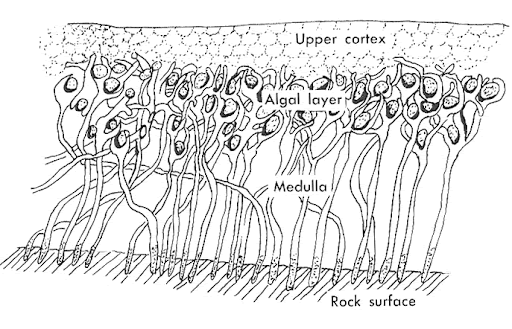
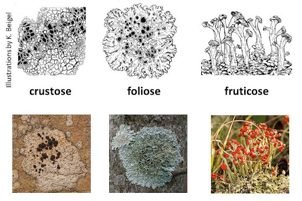
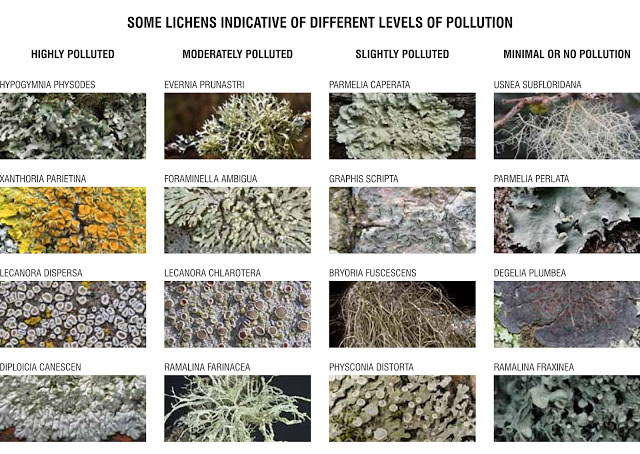

# Ask an interesting question

```{r}
#| label: set-up
#| include: false

# set options
knitr::opts_chunk$set(
  tidy = FALSE, 
  message = FALSE,
  warning = FALSE)

options(htmltools.dir.version = FALSE)

```

After completing this set of activities, you should be able to:

**After completing this activity, you should be able to**

-   Articulate the importance of considering different spatial scales for ecological questions (ecosystems, landscapes, biomes).
-   Describe how humans have impacted the biosphere to alter how ecosystems are distributed (land-use change, anthromes).
-   Describe how data gathered from multiple large-scale monitoring efforts (e.g. National Ecological Observatory Network (NEON), National Land Cover Data (NLCD), air quality (US EPA)) can be combined to investigate ecological questions at different spatial scales.
-   Compare the relationship of two continuous variables using scatterplots and interpret the results of a linear regression.
-   Compare the relationship of a categorical variable with \> 2 variables and interpret the results of an ANOVA.

The distribution and abundance of species are affected by the abiotic (non-living) and biotic (living) environment. Land-use modification and other anthropogenic drivers of environmental change including air pollution affect landscape, local, and micro-site conditions. This, in turn, influences the ability of a given species to survive or thrive in an area. Over the next few weeks we are going to explore how abiotic and biotic variables affect the presence and abundance of lichens at various spatial scales.

## Exploration of human impacts on landscapes

### Anthromes describe the human impacts on biomes

A climate zone is a section of earth’s surface defined by its average annual temperatures and total precipitation, along with monthly/seasonal averages and extremes. A biome is a section of earth surface with a characteristic community of plants and animals. Because abiotic conditions such as temperature and precipitation are primary determinants of which plants can grow in different area. Biomes are organized within broad latitudinal zones (decreasing average temperature) by levels of precipitation.

::: {.callout-tip title="Give it a try"}
-   [Use this link to open the Interactive Biome Viewer](http://media.hhmi.org/biointeractive/biomeviewer_web/index.html) and orient yourself to the tool
-   Choose a location by clicking on it or using the search bar in the upper right corner.
-   Explore the data panel on the right to review how to interpret a climatogram
    -   What is the location?
    -   What is the maximum and minimum monthly average temperature?
    -   What is the average annual temperature?
    -   What is the maximum and minimum monthly precipitation?
    -   What is the total annual precipitation?
-   The left-hand legend shows the different major biomes - clicking on any of them will give you a brief description.
:::

Now we are ready to explore broad geographic patterns.

::: {.callout-tip title="Give it a try"}
Together with your lab partner, briefly review how biomes are organized, what their characteristic vegetation looks like and what the key abiotic factors are that determine the vegetation (and other species present in ecosystems).

-   At the top of the legend use the left arrow to change to maps showing terrain, precipitation, and temperature. Identify broad patterns at large geographic scale.
-   The temperature and precipitation maps have a menu at the bottom that allows you to switch between different months, so you can also assess variability across the year.
-   Utilize the fact that between you and your lab partner you can have different maps open on your screens.

Discuss with your partner what the broad patterns are that you observe that are generating the major patterns of distribution of ecosystems on our planet. Be ready to share your insights with your lab section!
:::

Eugene Stormer and Paul Crutzen coined term Anthropocene in 2000 to describes an "unofficial" geologic time that emphasizes the fact that in the last 100 - 200 years humans have had a significant impact on the our plants climate and ecosystems. Similarly, we use the term "**anthromes**" or "**anthropogenic biomes**" [based on this 2008 publication by Erle Ellis and Navin Ramankutty](https://anthroecology.org/publication/putting-people-in-the-map-anthropogenic-biomes-of-the-world/) to describe global ecological patterns resulting from direct human interactions with ecosystems.

::: {.callout-tip title="Give it a try"}
Use the left hand legend to switch to the "**Anthromes**" map to explore how human impacts have reshaped biomes.

-   Use the legend to learn about the six categories of anthromes.
-   Use the bottom menu to see how the distribution of anthromes has changed over the last 300 plus years. Discuss with your lab partner whether this fits your expectations and identify broad patterns.
-   Spend some extra time with the map representing 2000 and discuss with your partner what our current large-scale patterns are. Revisit your conversation about the primary determining factors for ecosystems when we consider biomes and argue whether you think that currently there actually are other, more important factors shaping the distribution of biodiversity.

*Note that "green" means wildlands - i.e. those are "untouched" with little human populations/agriculture, they do not necessarily need to be forested areas. If you click on any location on the map it will still give you the pop up with a local biome description so you can compare what type of wildland you would expect to see.*
:::

Anthromes are a qualitative descriptor for large-scale assessments. Quantitative metrics are typically generated using a geographic information system (GIS[^d01_question-1]) to calculate measures of heterogeneity, patchiness, edge length, as well as species richness and evenness to characterize habitats. Frequently those quantitative metrics are then used to generate **land cover classifications** that assign categories to patches of the environment at a range of grains (resolution) and extent (spatial scales) .

[^d01_question-1]: Shameless plug for the Intro to GIS course offered by the Computer Science department and Remote Sensing offered by the Physics Department if you are interested in spatial analysis and learning how to generate maps.

The **Multi-resolution land characteristics** (MLRC) Consortium of Federal agencies has developed the National Land Cover Database 2016. [**You can use this link to access the legend and description of the different classifications**](https://www.mrlc.gov/data/legends/national-land-cover-database-class-legend-and-description)**.** There also is a PDF in your project folder with that information. This system classifies land cover in 20 land cover types using 30m by 30m grids based on remotely sensed (satellite) imagery.

::: {.callout-tip title="Consider this"}
Look over the NLCD classifications with your lab partner and compare and contrast them to the anthrome categories you just looked at.
:::

### Long-term monitoring networks allow us to ask questions at continental-scales

::: {.callout-tip title="Consider this"}
Given your recent insights into biomes and anthromes, and land-use change and land cover classifications, have a brief discussion with your lab partner about the potential value of measuring and recording environmental conditions and the organisms living in a particular area over a long time period. Consider at what scale you think this should occur.
:::

The National Ecological Observation Network (NEON) is a network of long-term monitoring stations with the goal of enabling a better understanding and forecasting of climate change, land use change, and impacts of invasive species on a continental scale. NEON field sites encompass 20 ecoclimate domains[^d01_question-2] representing distinct regions of vegetation, land forms, and ecosystem dynamics capturing the full range of US ecological & climate diversity. Each domain has at least one field site where a wide range of sensor measurements and field observations are used to generate comprehensive data on plants, animals, soil nutrients, freshwater systems, and the atmosphere using observational sampling during growing season, year-round high resolution data using automated instruments and airborne remote sensing surveys every two to five years. The goal of this long-term data collection is to capture temporal change and spatial diversity at site, regional, and continental-level scales.

[^d01_question-2]: Think of the eco-domains as being very similar to the concept of partitioning the biosphere into biomes. Specifically, NEON statistically partitioned the continental US, Hawaii and Puerto Rico into eco-domains that represent distinct regions with characteristic vegetation, landforms, and ecosystem dynamics

Long-term monitoring networks and standardized sampling protocols as implemented in NEON contribute to the reliability, comparability, and utility of environmental and scientific data, supporting better decision-making and understanding of complex systems. Especially in the context of understanding phenomena at large temporal and spatial scales, long-term monitoring enables identification of trends and patterns over extended periods, helping researchers and policymakers understand changes and make informed decisions. Long-term data collection helps establish baseline conditions, which is essential for assessing the impact of disturbances or human activities over time. In turn, ongoing continuous monitoring then provides the ability to detect changes in environmental variables or ecosystems early on, which is crucial for addressing emerging issues or threats. Similarly, it enhances the reliability and accuracy of data by providing a comprehensive understanding of variability and reducing the impact of short-term fluctuations or anomalies.

Standardized sampling plays a critical role in long-term monitoring as it ensures consistency in data collection methods, making it easier to compare results across different studies, locations, and time periods. Specifically, the standardization allows for meaningful comparisons between different sites or regions, facilitating a broader understanding of patterns and trends on a larger scale. This contributes to the overall quality assurance of data by minimizing variations introduced by different sampling techniques or methodologies. Additionally, standardization often leads to more efficient use of resources, as researchers can adopt established protocols rather than developing new methods for each study.

Let's take a closer look at the NEON field sampling sites

::: {.callout-tip title="Consider this"}
Your instructor will show you how to explore the NEON field sites. Then take some time to explore the two sites assigned to you and compare and contrast the differences in biomes and land cover data.

-   Navigate to the [**NEON Field Sites Overview website**](https://www.neonscience.org/field-sites/explore-field-sites)
-   Use overview table & map to explore each site.
-   In the Site Column the Site Details link will pull up a separate website with more detailed information for a specific site.
-   Clicking on the hyper-linked Site name will zoom in the map on a specific site. In the top left corner show select the satellite imagery base map select layers to overlay the land cover and urban impervious surfaces maps one at a time..
-   In the top right select the legend drop down menu. Leave the AOP (aerial observation platform) flight box boundary selected so you can orient yourself to where the NEON field site is but uncheck the remaining features.
-   Open the legends for land cover/impervious surfaces for quick reference.
-   There is a scale bar in the bottom left, start with a 2km scale, zoom out to 10km, then zoom out to 20km and observe the landscape surrounding the NEON site.
:::

## Exploration of continental-scale patterns of lichen distributions

### Lichens are ubiquitous, composite organisms with distinct habitat requirements

Lichens are composite organisms, which means that they are made up of two independent organisms living in symbiosis[^d01_question-3]. @fig-lichen-thallus shows the generalized structure of a lichen. Lichens are mutualistic symbionts, meaning that both the fungus (the **mycobiont**) and algae or cyanobacteria (the **photobiont**) benefit from the close association. The algae or cyanobacteria are photosynthetic, so the fungus benefits from the carbon compounds (sugars) that the algae or cyanobacteria produce. In turn, the algae or cyanobacteria gain protection, nutrients, and moisture from the fungus.

[^d01_question-3]: Symbiotic interactions are long-term interactions between two organisms in close physical proximity in which at least one partner benefits while the other organisms is either helped, harmed, or the interaction has no effect.

[{#fig-lichen-thallus}](https://archive.bigelow.org/mitzi/spray_3.html)

Lichens can be classified based on the structure of their **thallus** - their nonreproductive tissues or vegetative parts. Luckily,

There are three main types of lichens (@fig-lichen-morphotypes)

-   **Crustose lichens** are crust like and strongly adhere to the substrate; their color varies

-   **Foliose lichens** are leaf-like; they are 2 dimensional (i.e they have top and bottom "sides); they are flat and leafy like lettuce with ridges or bumpy.

-   **Fruticose lichen** are branched-upright or or **pendulous** (hanging down loosely); they are

    3-dimensional and look hair-like or upright and shrubby

{#fig-lichen-morphotypes}

Lichens are widespread and can be found in harsh climates, from hot deserts to cold alpine summits. However, within those ecosystems, they are found in specific **habitats** (natural environments in which they live). The key requirements for lichen habitat are: **water, air, nutrients, light**,and **substrate type**. 

-   **Water.** Lichens easily absorb water and water vapor through the outer layer of cells (**cortex)**, but lack mechanisms to conserve water during drought periods. The water content of lichens is determined by their surrounding environment[^d01_question-4]: lichens lose water, dry up, and become dormant during dry periods, then rehydrate and become photosynthetically active when moisture is available.
-   **Air.** Not only do lichens absorb water from surrounding air, lichens also absorb nutrients and pollutants. As a results, they are sensitive to many air-borne pollutants, and the presence and abundance of some species of lichen are reduced in areas high in atmospheric pollution. For example, sulfur dioxide (SO~2~) combines with moisture in the atmosphere to form sulfurous acid (H~2~SO~3~) or sulfuric acid (H~2~SO~4~). High levels of SO~2~ pollution are associated with decreased lichen respiration and photosynthesis, deactivation of enzymes resulting in reduced metabolic activity and reduced membrane integrity.
-   **Nutrients.** Nutrients (e.g., nitrogen, carbon, oxygen) are needed for cellular processes that support lichen growth and survival. Lichens obtain their nutrients from air and water, and, to a lesser extent, their substrate.
-   **Light.** Lichens are able to fix energy and carbon using photosynthesis and, thus, they require light, carbon dioxide, and water.
-   **Substrate.** Lichens require a substrate to attach to, and can be found on both natural (e.g., trees, rocks, soil) and artificial substrates (e.g., tombstones, buildings, abandoned equipment). Furthermore, characteristics of the substrate can influence how lichens interact with other aspects of their habitat. For example, substrate pH (e.g., limestone, tree bark with high (basic) pH) can counteract the acidity of SO~2~ pollution, so that in high pollution areas lichens may be found only on sites with high (basics) pH.

[^d01_question-4]: Here's a fun scrabble word: This means they are **poikilohydrous.**

### Lichens are bioindicators used to assess ecosystem health

Lichens are ubiquitous in urban and rural areas, and are also an important group of **bioindicators** - an organism whose presence, absence, and/or abundance in an area gives an indication of the degree of health of that ecosystem. For example, some organisms are very sensitive to pollution in the environment (@fig-pollution), so if pollutants are present, that organism may be absent, or may have different morphology or physiology, or may change its behavior. In contrast, other organisms are less sensitive to pollution in the environment. Documenting which of these bioindicator organisms are present, absent, and/or abundant in an area can be valuable in assessing ecosystem health and understanding whether or not an ecosystem may be impaired by pollution.

{#fig-pollution}

Similarly, some species of lichens are very sensitive to atmospheric pollution (e.g., nitrogen, sulfur, lead), whereas other species of lichens are tolerant to those pollutants. Notably, the degree of sensitivity of a lichen to air pollution varies roughly with their growth form. This makes lichens ideal to use as bioindicators for air pollution. For this lab unit, we will be using a modified version of the Hawksworth and Rose (1970) air quality index. This air quality index is based on the type of lichen(s) present, and ranges from 1 to 10, with 1 indicating the poorest air quality and 10 indicating the best air quality (@tbl-air-pollution). In general, lichens that are least sensitive to air quality are crustose lichens, lichens most sensitive to pollution are fruticose lichen, with foliose lichens falling inbetween. Two species of fruticose lichen, *Lobaria pulmonaria* and *Teloschistes exilis*, are extremely sensitive to air pollution and, thus, if either species are present, the air quality is considered very high.

|  |  |  |
|------------------------------------|------------------|------------------|
| **Lichen Type** | **Air Quality** | **Air Quality Score** |
| No lichens present | very poor | 1 |
| Crustose only | poor | 3 |
| Foliose present, but no fruticose | moderate to good | 6 |
| Fruticose present | good | 9 |
| *Lobaria pulmonaria* or *Teloschistes exilis* present; fruticose lichens, very sensitive to pollution | very high | 10 |

: Modified Hawksworth air quality index {#tbl-air-pollution}

::: {.callout-tip title="Consider this"}
Use [**this link to access current Air Pollution Data published by the EPA**](https://gispub.epa.gov/airnow/?contours=ozone&monitors=ozonepm&showlegend=no&xmin=-16322174.592208797&xmax=-5745735.86244834&ymin=-123790.4341174569&ymax=8388237.035717508)**.**

-   Take a look and discuss general patterns you observe with your lab partner.
-   Argue whether you think that using lichens as bioindicators is more or less informative compared to the information gained from real-time air pollution monitors.
:::

### Wet deposition data sets inform our understanding of air pollution

Air pollution results from different sources including gaseous, particulate, dust, and biological pollutants. Generally, we classify them by their size as coarse or particulate matter. For this module, we are going to focus on PM2.5 which is fine particulate mater with a diameter \< 2.5 µm and is closely associated with health risks.

Currently, air pollution levels are simultaneously improving and getting worse. Since the Clean Air Act of 1963, and the 1970 amendment to authorize the EPA to regulate air pollutants and additional legislation tightening vehicle factory, and power plant emissions, we have see a steady increase in air quality. However, in recent decades we have seen an increase in wildfires which locally create dangerous air quality conditions during certain times of the year. As with many environmental issues the impacts are felt disproportionately by already vulnerable groups such as people with chronic disease, the elderly, and people of lower socioeconomic groups who cannot afford installing air filters or other protective measure and frequently live in areas that are more exposed and/or have jobs that more frequently require them to be outside.

Typically, air pollution monitoring is performed using gravimetric monitors operated by the US Environmental Protection Agency (EPA). However, the overwhelming majority of monitors is concentrated in cities (\>90%) and as a result for rural areas only limited data is available. Another option is wet deposition data which is produced by measuring the pollutants washed out the atmosphere by rain or snow. Air pollution travels with the wind and with rain or snowfall particulate matter and chemicals containing nitrogen and sulfur are deposited in soils and surface waters which can acidify or fertilize them. Nitrogen compounds come from natural sources such as wildfires and lightning but can also end up in the atmosphere from anthropogenic sources including power plants, industrial facilities, or agricultural practices. Sulfur compounds are emitted during fuel combustion in power plants, cars, or other industrial facilities.

[Wet deposition chemical analysis is one data product](https://data.neonscience.org/data-products/DP1.00013.001) generated by the NEON monitoring efforts. Specifically it contains total dissolved chemical ion concentrations of sulfate, nitrate, chloride, bromide, ammonium, phosphate, calcium, magnesium, potassium, sodium, and pH and conductivity in precipitation water.

### Comparison of Lichen distribution across NEON sites

Let's explore some of the key factors that could be affecting the distribution of Lichen at large (continental-level) scales.

```{r}
#| label: setup
#| eval: true
#| message: false
#| error: false
#| warning: false

# load libraries for reporting
library(knitr)

# load libraries for data import
library(readr)
library(here)
library(janitor)

# load libraries for data wrangling
library(dplyr)
library(tidyr)
library(tibble)
library(broom)

# load libraries for plotting
library(ggplot2)
library(ggthemes)

# load library for stats
library(infer)

set.seed(42)

# read data set
lichen <- read_delim("data/NEON-lichen-wet-deposition.tsv", delim = "\t") |>
  clean_names()

# overview
glimpse(lichen)

# get column names
colnames(lichen)

```

This data set contains a column titled `lichen_index` that indicates relative abundance across sample locations. Each row is a plot within a NEON site. Larger numbers indicate higher prevalence of lichens in that location. This will be our **response variable**.

Possible **explanatory variables** include dominant land cover classifications, percent canopy cover, and wet deposition data.

::: {.callout-tip title="Consider this"}
Before we get started consider how you could visualize each relationship and what you expect the relationship to look like for. Think about what types of variables you are comparing (categorical, continuous). It can be helpful to sketch it out on a scrap piece of paper to help you think through it.)

-   Canopy coverage
-   Land cover classification
-   Wet deposition data
:::

#### Impact of canopy coverage

In this case we are comparing two continuous variables. Generally we visualize this type of data using a scatter plot with the explanatory (independent) variable on the x-axis and the response (dependent) variable on the y-axis. We can add a line line of best fit that models the relationship between the two variables as $y = mx +b$.

```{r}
#| eval: false

# plot canopy coverage vs overall lichen abundance
ggplot(object,
       aes(x = colname,
           y = colname)) +
  stat_smooth(method = "lm") +
  geom_point() +
  labs(x = "x axis title",
       y = "y-axis title") +
  theme_classic()

```

::: {.callout-tip title="Give it a try"}
Complete the code above to visualize the relationship of canopy coverage and lichen abundance

Briefly describe the relationship you are observing and determine whether or not this fits your expectations. Speculate what factors could be causing this pattern.
:::

::: {.callout-note title="Answer" collapse="true"}
```{r}
#| label: fig-canopy
#| fig-cap: "Relationship of canopy coverage and overall lichen abundance."
#| message: false
#| error: false
#| warning: false
#| fig-cap-location: bottom

# create plot
ggplot(lichen,
       aes(x = percent_canopy_cover,
           y = lichen_index)) +
  stat_smooth(method = "lm") +
  geom_point() +
  labs(x = "Canopy Cover",
       y = "% canopy cover") +
  theme_classic()

```
:::

When we are comparing two continuous variables we use a linear regression to determine whether or not this is a statistically significant relationship or if the pattern we are observing is likely due to random chance alone using a generated p-value.

It also allows us to quantify the proportion of variance of the response variable can be explained by the predictor or explanatory variable using the R^2^ value.

::: {.callout-tip title="Give it a try"}
Complete the following code chunk and identify the p-value and R^2^ from the output and interpret what this means regarding the results you just described.

```{r}
#| eval: false

# test relationship
lm(formula = colname ~ colname,
                 data = object) |> 
  summary()

```
:::

::: {.callout-note title="Answer" collapse="true"}
```{r}
#| label: anova-canopy

# test relationship
lm(lichen_index ~ percent_canopy_cover,
                 data = lichen) |> 
  summary()

```

The Coefficients section shows us that the p-value (`Pr(>|t|`column) for the predictor variable `PercentCanopyCover` is 0.006. This indicates that the pattern we are observing is statistically significant.

However, our adjusted R^2^ value value is quite small (0,0063) indicating that canopy coverage explains less than 1% of the variance observed in lichen abundance. So while Canopy Coverage appears to play a role in lichen abundance, at this large geographic scale it does not play an important one and other factors are likely more important determining the growth of lichen. It would probably be interesting to explore this factor at a more local scale (hint, hint).
:::

#### Comparison of land cover classification

Another interesting potential driver of lichen distribution we can explore is the land cover classification for the dominant habitat in each survey plot to determine if this is an important factor at this large of a scale. This is a categorical predictor variable, which is something we have done in our previous data analyses. However, in this case, we have a large number of categories as opposed to just two, we means we will need to adjust how we test for significance.

```{r}
#| eval: false

# plote relationship

```

::: {.callout-tip title="Consider this"}
Complete the code above to plot the relationship of land cover and lichen abundance.

Briefly describe your results and determine whether or not this fits your expectations. Speculate what factors could be causing this pattern.
:::

::: {.callout-note title="Answer" collapse="true"}
```{r}
#| label: fig-land-cover
#| fig-cap: "Comparison of lichen abundance across different habitat types categorized according to dominant Land cover classification."
#| message: false
#| error: false
#| warning: false
#| fig-cap-location: bottom

# calculate summary statistics (mean, sd)
summary <- lichen |>
  group_by(nlcdc) |>
  summarize(mean = mean(lichen_index),
            sd = sd(lichen_index))

# create plot
ggplot(summary) +
  geom_pointrange(aes(x = nlcdc,
                    y = mean,
                    ymin = mean-sd,
                    ymax = mean+sd,
                    color = nlcdc),
                size = 1.2) +
  labs(x = "Land cover classification (NLCDC 2016)", 
       y = "Lichen relative abundance") +
  coord_flip() +
  theme_classic() +
  theme(legend.position = "none")
```
:::

Normally, we would run a t-test to determine if the difference between two means is statistically significant or if the patterns we are observing are due to random chance alone. In this case we have more than two categories and so instead we would use an ANOVA which allows us to compare more than two categories and generate a p-value.

::: {.callout-tip title="Give it a try"}
Run the code chunk below to determine if there are significant differences in the observed patterns and interpret your results. Consider how this might inform your interpretation of the tree coverage data above.

```{r}
#| eval: false

# test relationship
anova <- aov(colname ~ colname,
    data = object)

summary(anova)

# Post-hoc test for pairwise comparisons
tukey_df <- tidy(TukeyHSD(anova))

# print table
tukey_df |>
  arrange(adj.p.value) |>
  kable()

```
:::

::: {.callout-note title="Answer" collapse="true"}
```{r}
#| label: anova-NLCDC
#| message: false
#| error: false
#| warning: false

# test relationship
anova <- aov(lichen_index ~ nlcdc,
    data = lichen)

summary(anova)

# Post-hoc test for pairwise comparisons
tukey_df <- tidy(TukeyHSD(anova))

# print table
tukey_df |>
  arrange(adj.p.value) |>
  kable()

```

In this case our p-value for the NLCDC categories is found in the `Pr(>F)` column. It is smaller that 0.05 indicating that Land Cover (Habitat types) play a key role in determining the amount of lichens present in a surveyed plot.

An interesting aspect is that we see a large difference in lichen presence of Evergreen compared to deciduous forests - this interesting pattern could be a key factor explaining the tree canopy data we observed earlier.
:::

#### Wet deposition data

Finally lets take a look at the wet deposition data which is a way of measuring air pollution in an area.

::: {.callout-tip title="Give it a try"}
Pick either pH or Conductivity as your explanatory variable and modify the code below to create a scatter plot and perform a linear regression. Describe and interpret your results and be ready to share what you have learned with the class.

```{r}
#| eval: false

# create plot
ggplot(object,
       aes(x = colname,
           y = colname)) +
  stat_smooth(method = "lm") +
  geom_point() +
  labs(x = "x axis title",
       y = "y axis title") +
  theme_classic()

# test relationship (response ~ explanatory)
lm(colname ~ colname,
   data = object) |> 
  summary()


```
:::

::: {.callout-note title="Answer" collapse="true"}
Significance of relationship and proportion of variance in lichen abundance explained by bark pH.

```{r}
#| label: fig-wet-deposition-ph
#| fig-cap: "Relationship of bark pH and lichen abundance across NEON sites."
#| message: false
#| error: false
#| warning: false
#| fig-cap-location: bottom

# create plot
ggplot(lichen,
       aes(x = p_h,
           y = lichen_index)) +
  stat_smooth(method = "lm") +
  geom_point() +
  labs(x = "Precipitation pH",
       y = "Lichen abundance") +
  theme_classic()

# test relationship
lm(lichen_index ~ p_h,
   data = lichen) |> 
  summary()

```

Significance of relationship and proportion of variance explained by conductivity of precipitation.

```{r}
#| label: fig-wet-deposition-conductivity
#| fig-cap: "Relationship of conductivity and lichen abundance across NEON sites."
#| message: false
#| error: false
#| warning: false

# create plot
ggplot(lichen,
       aes(x = precip_conductivity,
           y = lichen_index)) +
  stat_smooth(method = "lm") +
  geom_point() +
  labs(x = "Precipitation conductivity",
       y = "Lichen abundance") +
  theme_classic()

# test relationship
lm(lichen_index ~ precip_conductivity,
   data = lichen) |> 
  summary()

```
:::

::: {.callout-tip title="Give it a try"}
Pick one of the chemicals measured in the wet deposition (Calcium, Magnesium, Potassium, Sodium, Ammonium, Nitrate, Sulfate, Phosphate, Chloride, Bromide) and determine if it explains a significant proportion of the variance observed in the lichen abundance.

Modify the code below to create a scatter plot and perform a linear regression. Describe and interpret your results and be ready to share what you have learned with the class.

```{r}
#| eval: false

# create plot
ggplot(object,
       aes(x = colname,
           y = colname)) +
  stat_smooth(method = "lm") +
  geom_point() +
  labs(x = "x axis title",
       y = "y axis title") +
  theme_classic()

# test relationship (response ~ explanatory)
lm(colname ~ colname,
   data = object) |> 
  summary()

```
:::

::: {.callout-note title="Answer" collapse="true"}
Example: Sulfates

```{r}
#| label: fig-wet-deposition-II
#| fig-cap: "Comparison of lichen abundance and wet deposition of sulfates across all NEON sites."
#| message: false 
#| error: false 
#| warning: false
#| fig-cap-location: bottom

# create plot
ggplot(lichen,
       aes(x = precip_sulfate,
           y = lichen_index)) +
  stat_smooth(method = "lm") +
  geom_point() +
  labs(x = "wet deposition sulfate",
       y = "lichen abundance") +
  theme_classic()

# test relationship (response ~ explanatory)
lm(lichen_index ~ precip_sulfate,
   data = lichen) |> 
  summary()

```
:::

## Key takeaways & Discussion

For this week's homework assignment write three paragraphs (approx. 150 - 300 words/7-10 sentences each) that each describe a key take-away from today's lab. Submit your paragraphs as a pdf or word document through Canvas.

To complete this assignment, flip back through your notes and pick three things that stand out to you as being surprising, interesting, something new that you learned, something that has become more clear to you. One of your key takeaways should related to the results from the wet deposition data we explored. Pick two additional take-aways from different topics we explored today: Long-term monitoring efforts, the concept of bioindicators, the impact of humans on biomes.

This is intentionally meant to be a more broad prompt. Criteria for evaluations are that make a good faith effort to clearly formulate your take-away. Start your paragraph with sentence that summarizes your key take-away and then elaborate on that key point in a paragraph (150-300 words).
