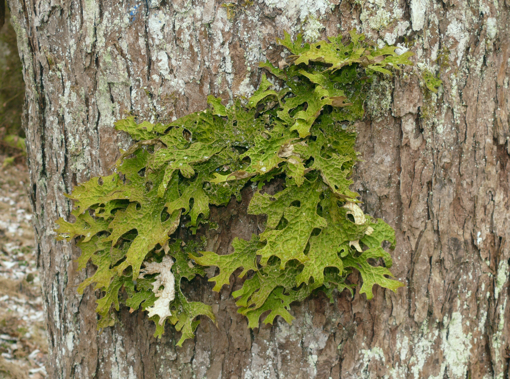
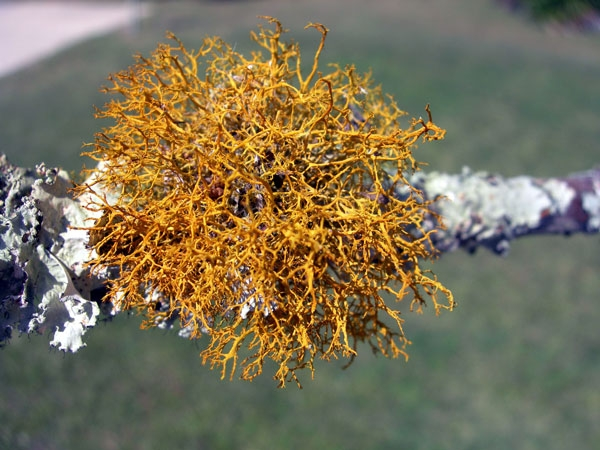

# Collect your data

```{r}
#| label: set-up
#| include: false

# set options
knitr::opts_chunk$set(
  tidy = FALSE, 
  message = FALSE,
  warning = FALSE)

options(htmltools.dir.version = FALSE)

```

## Prepare your lichen sampling grid {#sec-prepare-your-sampling-grid}

Collect the following items to make your sampling grid:

-   Lichen sampling grid template
-   Quart freezer baggie
-   Tape (to hold the baggie and grid in place)
-   permanent marker

Work with your lab partner to create a sampling grid to determine lichen coverage in the field:

1.  Take the double-layer freezer baggie, and separate the two layers using a pair of scissors.
2.  Place the freezer baggie on top of the lichen sampling grid template.
3.  Secure the template and freezer baggie to a flat surface, so that they don’t move.
4.  Using the Sharpie permanent marker, trace grid circles and lines . Try to avoid making any smudges. (Do not rush or you may cause the freezer baggie to slip.)
5.  Let the ink dry.

## Field Sampling Protocol {#sec-field-sampling-protocol}

*You will be given a physical copy of the field sampling protocol along with data sheets to take with you into the field.*

Each group (1 - 8) will sample trees using the process described on the following pages.

**Trees should be a minimum of approximately 30 cm (12 in) diameter**.

::: {.callout-warning title="Heads up"}
Make sure to follow the instructions and record all of your data in the data sheets contained in your sampling packet, add notes and comments on your data sheets and then digitize your data in the collective data sheet and upload your images to the corresponding results folder (`Section` \> `grp-#`).

If you are going to be the person taking and uploading pictures, please make sure you have your camera settings set so your pictures will be exported as `*.jpg`.

It should take you about 10-12 minutes to sample each tree. Please be conscientious when you are collecting the data; we would like to add our data set to the EREN Lichen project which means that your care in gathering and uploading your data matters.
:::

### Equipment Checklist {#sec-equipment-checklist}

Before you head out, make sure you have gathered all the necessary equipment.

1.  Clipboard
2.  Field Data sheets
3.  Handheld Compass and/or digital compass/app with the ability to determine latitude and longitude (e.g. Trail Sense app, My GPS Location)
4.  Smartphone with camera setting to export pictures as `*.jpg` (if you have an iPhone you may have to change this setting)
5.  Lichen Air quality scoring table (including in sampling protocol)
6.  Measuring Tape
7.  Quart freezer sampling grid
8.  Pens, Dry erase markers
9.  Chisel
10. Brown paper bag
11. Tree ID booklets, SEEK smartphone app

### Sampling Protocol {#sec-sampling-protocol}

#### Step 1. Choose a tree to sample and identify the tree species.

*Your tree does not have to have lichen on it. We also want to know what trees look like that do not have lichen on them.*

-   Pick a tree in your assigned sample area that is at least 30 cm (approx 1ft) in diameter.
-   Determine if your tree is **deciduous** or **coniferous** and record that on your data sheet.
-   If possible, use the tree identification key and/or smartphone app “Seek” to **identify the tree** to species level (we are likely sampling too early in the year to identify trees using their leaves)
-   **Take pictures** that will allow us to identify/confirm the tree species down the line.
    -   Photo 1a: Leaves or leaf buds.
    -   Photo 1b: Characteristic bark.
    -   Photo 1c etc other characteristics to assist in tree identification

#### Step 2. Measure tree diameter, in centimeters.

*Tree diameter (**diameter at breast height; dbh**) is measured at 1.37 m (4.5 ft) above ground level.*

-   Use the **tape-measure** to determine 1.37m above ground on the tree trunk.
-   **Measure** and **record** the **circumference** of your tree in your data sheet.
-   Double check that you measured and recorded the values in cm! We will convert to diameter during data entry.

#### Step 3. Determine latitude and longitude and the north-facing aspect of the tree.

*Note**: Aspect** refers to the orientation (direction) that a surface faces.*

-   Use a compass or compass app on your smartphone to identify **North**, then, move to the tree.
-   Standing with the compass in your hand, your back to the tree, and facing away from the tree - move around to determine which part of the trunk faces North.
-   Use a compass or similar app to **determine latitude** and **longitude** of your tree and **record** it in your data sheet.

#### Step 3. Record the canopy cover

*We will be completing our survey early spring when the leaves will likely not yet have emerged on many of the trees that we will assess. Where possible, we will be taking a photo to allow us to calculate % coverage to add to the long-term data set we are building. For those of you who have formulated a hypothesis about the relationship of canopy coverage and lichen coverage we will make a qualitative assessment based on the type of tree (deciduous trees have greater/denser foliage compared to coniferous trees) and whether you are sampling a free-standing tree compared to small groups or a dense, continuous forested area.*

-   Stand at the base of the tree, at the north side of the tree.
-   Open up your camera app.
-   With your back to the tree, hold the phone overhead (making sure it is parallel to the ground), and take the photo (*Photo 2*).
-   This picture will allow us to determine the canopy cover at a later point in time and add it to our data set.
-   Survey the area around your tree and determine which category your tree falls into and **record** that category on your data sheet
    -   **Free standing**: Your tree is isolated, there are no trees in immediate vicinity with potential overlapping canopies.

    -   **Small group**: Your tree is a part of a small group (3-5 trees) that are growing near each other (this could also include a row of trees along a street), at least some of their canopy would overlap.

    -   **Forested area**: Your tree is in a continuous forested area, canopies overlapping. This could include a small edge habitat (e.g. non-developed property) or actual forest.

#### Step 4. Record percent lichen at the north, east, south, and west faces of the tree.

-   Take the clear lichen sampling grid, and place the top of the grid at 1.37 m (4.5 ft) above the ground at the north-facing aspect of the tree.
-   The sampling grid has 10 rows of 10 circles forming a grid. Count the number of squares that have lichens underneath them. You can use a dry erase marker to help you keep track of the count.
-   **Record** the value on your datasheet.
-   **Repeat** for the east, south, and west-facing aspects of your tree.

#### Step 5. Document the lichen diversity on your tree.

*Note: We are planning on using the data generated during this lab to contribute to the EREN lichen project. To make this possible, it is important that you take and upload the photos in the specific order outlined in this sampling protocol. Photos 1a, b etc should be identifying features of your tree, Photo 2 is the canopy coverage from the north-facing aspect and Photos 3a - e document the lichens on the tree and can be used for more precise species identification than what we are using for this lab down the line. You can take these images while you are recording the lichen coverage but make sure to take the sampling grid down before taking the picture so the lichens are clearly visible.*

-   Photo 3a: Look around the tree and find the dominant lichen. Find a good example of the dominant lichen and take a picture.
-   Photo 3b: Take an image of where you took the first lichen sampling grid reading, on the North face of the tree without the grid covering it. You will probably capture a bit more than the area you sampled with the grid - that is okay!
-   Photo 3c: Take an image of where you took the east-facing lichen grid sample.
-   Photo 3d: Take an image of where you took the south-facing lichen grid sample.
-   Photo 3e: Take an image of where you took the west-facing lichen grid sample.

#### Step 6. Determine the Hawksworth Rose index score based on the Lichen morphotypes present on your tree.

-   Carefully **observe** the lichen on the tree and assess and record which **morphotypes** are present (reference your sketches/annotations of key characteristics of crustose, foliose, and fruticose lichens as needed). Be sure to look over all areas of the tree (that are visible to you from the base of the tree) to identify lichen. It is not restricted to where you measured it with the lichen sampling grid.
-   **Determine** and **record** the Hawksworth Rose index score. Only enter one value into this field. For example, if you only have crustose lichen present, then it would be a score of 3. If you have both crustose and foliose lichens present, the index score will be 6. If you have crustose, foliose, and fruticose lichens present, the index score will be 9.
    -   No lichens present = 1
    -   Crustose lichens only = 3
    -   Foliose lichens present, but no fruticose = 6
    -   Fruticose lichens present = 9
    -   *Lobaria pulmonaria* or *Teleschistes exilis* present = 10

{#fig-Lpulmonaria width="600"}

{#fig-Texilis}

## Upload your images and digitize your datasheets {#sec-upload-your-images-and-digitize-your-datasheets}

### Upload you images to the shared google drive {#sec-upload-you-images-to-the-shared-google-drive}

After you return from the field make sure to upload the photos you took in the field in our shared google drive in the `data` folder under the corresponding `section-letter > group-#` folder. We are assuming that your pictures are in the sequence tree 1 - xx and in the specified sequence of photo 1 - 3. Please rename your photos with the file name `section-letter_grp-#_tree-#_photo-#.jpq`

### Enter your data in the shared spreadsheet {#sec-enter-your-data-in-the-shared-spreadsheet}

::: {.callout-warning title="Heads up"}
We are going to share the data set across all sections so each group can compare differences across microhabitats. In order to give us time to QC/QA the data so it's ready to go for the labs next week. Please complete your data entry within **48 hours of returning from the field**; data taken during Easter break should be entered by 4/21 at 9am.
:::

Open the shared spreadsheet in the `data` folder named `lichen-survey` and enter your data from the spreadsheets. Hover over each column header to see the notes on how to enter information.


## Determine the bark pH

::: {.callout-warning title="Heads up"}
We are sharing the set across all sections. This means that students in other sections are relying on the data you are generating. Please make sure that take the time to set up your bark sample to dry, soak, measure, and enter the pH data. We want to ensure enough time to QA/QC the data for next labs to be able to complete their data analysis.
:::

Trees differ in their bark pH, which can play a role in determining the lichen present on those species. For example Oak, Birch, Alter, Sweet Chestnut, Rowan, Hawthorn, Hornbeam, Pine and Spruce typically have low pH (acid bark), while Elm and Field Maple have high pH (base-rich bark) and Hazel, Ash, Sycamore, Willow and Lime trees have an intermediate pH.

Determine the pH of your sample using the following procedure:

1.  When you return from the field, leave your bark samples on the back bench to dry overnight (12-24 hours) in their labeled brown paper bags.
2.  The next day, return to the lab to soak your samples.
    -   Label a falcon and add your bark samples. Each set of bark samples (2 samples per tree) should be in a separate falcon tube.
    -   Fill it to the 10ml water mark distilled water. Make sure the bark sample is covered and leave to soak for 12 - 24 hours.
3.  After soaking use the pH meter to measure the pH of the water.
4.  Update the `GoogleSheet` for your tree to include the dry time, soak time, and measured bark pH.
